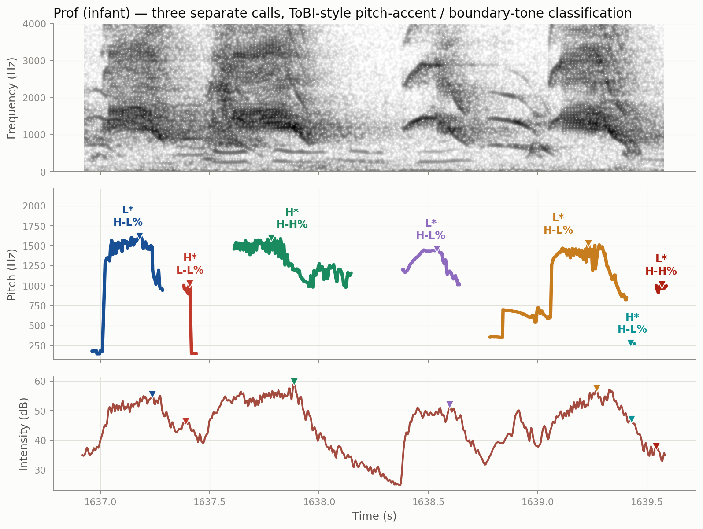
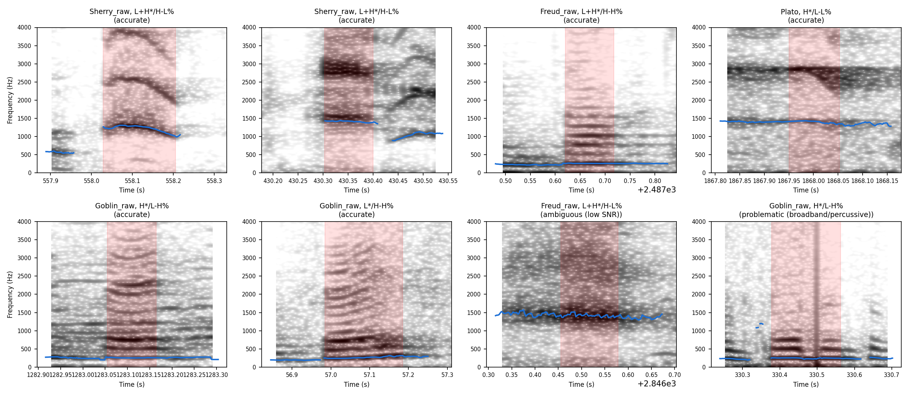
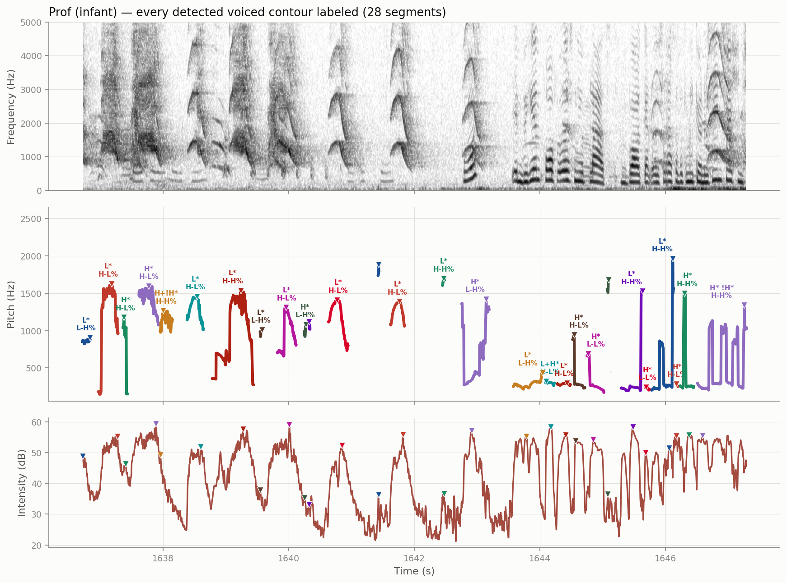

# chimp_prosody

A tested, modular pipeline for extracting pitch–intensity coordination
metrics and ToBI-style prosodic classifications from chimpanzee field
recordings, developed for the Gombe vocal development analysis.



*Three separate calls (infant subject), showing the full pipeline: spectrogram (top), pitch contour with each call's pitch-accent/boundary-tone classification (middle), and intensity with peak markers (bottom).*

## Features

- **Memory-safe audio handling.** Long field recordings (30+ minutes) are
  read in chunks directly from disk via `soundfile`'s random-access reads,
  with no intermediate files and no external subprocess calls. Verified
  against a real 19-minute recording to produce exact expected chunk
  boundaries.
- **Clean separation of logic and I/O.** All segmentation, ToBI-style
  contour classification, octave-error flagging, and pitch-intensity
  alignment logic lives in `core.py` as pure functions over plain numpy
  arrays, independent of file I/O or any particular audio library. This
  keeps the scientific logic easy to read, reuse, and test in isolation.
- **Manifest-driven pipeline.** A single entry point
  (`python -m chimp_prosody.pipeline manifest.csv output.csv`) processes
  any number of subjects from a simple CSV manifest (subject, file path(s),
  age class, age range), producing one combined output table.
- **Unit-tested against synthetic signals with known answers.** 22 tests
  cover segmentation, contour classification, octave-error flagging, and
  pitch-intensity alignment, using synthetic pitch/intensity arrays
  constructed to have a known correct classification. This gives the
  classification logic a layer of verification beyond visual/manual
  spot-checks.

  Pitch tracking itself was also validated against a stratified random
  sample of real segments, checked visually against their spectrograms:

  

- **Validated against the original analysis.** Re-running this pipeline on
  a full subject recording (Gilka) reproduces the originally reported
  results exactly: 148 segments, 65.2% mid-to-final covariation among
  non-flagged segments.

## Usage

1. Download the source recordings from the Gombe chimpanzee archive on
   Dryad (DOI 10.5061/dryad.5tq80) and place them in a local `data/`
   directory (not included in this repository — see LICENSE for why).
2. Run the pipeline against the provided manifest, which lists all 15
   subjects from the reported analysis along with their age classes and
   ranges:

```bash
pip install -r requirements.txt
python -m chimp_prosody.pipeline manifest_full.csv output.csv
```

Manifest CSV columns: `subject`, `file_paths` (semicolon-separated if a
subject has multiple archived tapes, e.g. Flint), `age_class`, `age_lo`,
`age_hi`, `age_mid`, and optional `chunk_minutes` to override automatic
chunk-size selection for a given file. For subjects with more than one
file, each subsequent file's timestamps continue from the end of the
previous one, so multi-tape subjects end up on a single continuous
timeline rather than each tape restarting at time 0.

## Running tests

```bash
python -m pytest chimp_prosody/tests/ -v
```

## A denser example

For a busier, real-world case, here are six consecutive bouts from a single
subject with every detected voiced contour labeled (28 segments total):



## Note on the bitonal-accent categories

The rarer, compound pitch-accent categories (H+!H\*, H\*!H\*) are detected
via peak-finding on the pitch contour, which is inherently less reliable
very close to a segment's boundary. `MIN_PEAK_PROMINENCE_HZ` and
`MIN_FRAMES_FOR_BITONAL_DETECTION` set conservative thresholds so that
ambiguous or very short segments default to a simple accent label rather
than a bitonal one; see the docstring in `core.classify_contour` for
details. This does not affect the paper's primary result (pitch-intensity
covariation, which does not depend on pitch-accent classification at all)
— it applies only to the secondary ToBI-category distribution reported in
the Results.


## Citations

If you use this code, please cite the paper it was written for:

Michlich, J.M. (2026). Pitch–intensity coordination in wild chimpanzee (Pan troglodytes) vocalizations: a robust within-call pattern, not an ontogenetic one. [preprint/ journal, DOI to be added].

### This pipeline builds directly on the following tools, frameworks, and data:

1. Boersma, P., & Weenink, D. (2023). Praat: doing phonetics by computer [Computer program]. http://www.praat.org/
2. Jadoul, Y., Thompson, B., & de Boer, B. (2018). Introducing Parselmouth: A Python interface to Praat. Journal of Phonetics, 71, 1-15. https://doi.org/10.1016/j.wocn.2018.07.001
3. Beckman, M. E., & Hirschberg, J. (1994). The ToBI annotation conventions. Manuscript, Ohio State University.
4. Plooij, F. X., van de Rijt-Plooij, H., Fischer, M., Wilson, M. L., & Pusey, A. (2015). An archive of longitudinal recordings of the vocalizations of adult Gombe chimpanzees. Scientific Data, 2(1). (Data: Dryad, https://doi.org/10.5061/dryad.5tq80)
